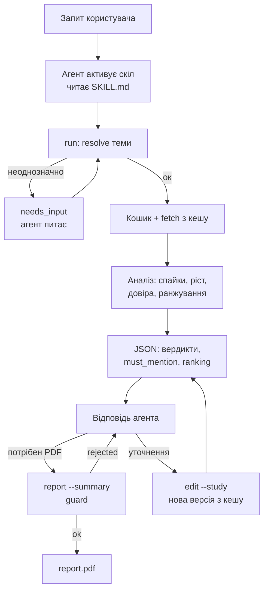

# Wiki Interest Skill — план і флоу

> **Для Claude Code.** Це робочий план тестового завдання. Працюй по фазах згори вниз, після кожного пункту відмічай чекбокс `[x]` у цьому файлі і коротко записуй рішення та перевірки в `DEVLOG.md`. Статистичну логіку спершу покривай тестами на синтетичних рядах з відомою відповіддю. Поведінку зовнішніх API перевіряй реальними запитами, а не з пам'яті. Не копіюй код з чужих репозиторіїв з рішеннями цього ж завдання.

## Завдання коротко

Самостійна навичка у форматі [Agent Skills](https://agentskills.io/specification), яка дозволяє агенту аналізувати [перегляди Wikipedia](https://doc.wikimedia.org/generated-data-platform/aqs/analytics-api/reference/page-views.html) у різних мовних розділах, будувати графіки й формувати короткі звіти (PDF на одну сторінку) для засновників B2C-продуктів: які теми розвивати і якими мовами запускатися.

Вимоги:
- `SKILL.md` + власний код, який виконує змістовну роботу з даними; не лише інструкції агенту
- Жодних скомпільованих файлів; залежності й середовище відтворювані; усе в директорії навички
- Має зручно працювати на швидкій дешевій моделі (Claude Haiku 4.5 або безкоштовні моделі OpenRouter); повний сценарій перевірити на такій моделі
- Рекомендації спираються на дані, припущення й обмеження зрозумілі; підтримка уточнень і повторних запитів
- Описати, як розвивати навичку далі для складніших досліджень і більших обсягів даних
- Пояснити, як використовувались AI-інструменти і як перевірявся їхній результат

Приклади запитів:
- Порівняй зростання інтересу до інтервального голодування в польськомовній та чеськомовній Wikipedia за останні два роки.
- Ми думаємо додати курс з астрономії. Чи зростає інтерес до цієї теми в україномовній Wikipedia, і наскільки цьому зростанню можна довіряти?
- Ми створюємо застосунок для вивчення мов. Порівняй інтерес до вивчення англійської у вибраних мовних розділах і підготуй короткий звіт: які аудиторії варто дослідити наступними й чому?

## Ключові рішення та структура

Принцип: **код вирішує, модель переказує**. Уся статистика, вердикти, довіра й ранжування — у коді; агент лише запускає команди й переказує готові частини.

| Рішення | Вибір | Чому |
| --- | --- | --- |
| Мова | Python 3.11+ | Найкраща екосистема для статистики й PDF |
| Середовище | uv + PEP 723 inline-залежності | Одна команда `uv run`, без ручного venv |
| PDF | fpdf2 + DejaVu Sans в `assets/` | Чистий Python, кирилиця, без системних бібліотек |
| Графіки | matplotlib (Agg) | Стабільно, без GUI |
| Статистика | numpy | `binomtest` і Theil–Sen — кілька рядків власного коду, без важкої scipy |
| Кеш | SQLite, рядок = (проєкт, стаття, дата) | Закриті місяці незмінні → кеш назавжди |
| Дані й кеш | `~/.cache/wiki-interest/` (перевизначення `WIKI_INTEREST_HOME`) | Директорія навички може бути read-only або спільною |
| Шляхи | у SKILL.md — команди від директорії SKILL.md (абсолютний шлях) | cwd агента — зазвичай проєкт користувача |
| Інтерфейс | CLI → компактний JSON у stdout, повні дані у файлі | Слабка модель не тоне в даних |

Структура скіла:

```
wiki-interest/
├── SKILL.md
├── README.md
├── DEVLOG.md                  # рішення + як перевіряв AI
├── scripts/
│   ├── wit.py                 # точка входу з PEP 723 заголовком
│   └── wikitrends/
│       ├── http.py            # User-Agent, ретраї, 429, кеш
│       ├── wiki.py            # Wikidata / MediaWiki API
│       ├── pageviews.py       # per-article, aggregate, access split, top-by-country
│       ├── resolve.py         # тема → QID, неоднозначність, proxy
│       ├── basket.py          # кошик статей
│       ├── series.py          # денні → місячні, повні місяці, нормалізація
│       ├── stats.py           # спайки, ріст, тренд, сезонність
│       ├── confidence.py      # правила довіри
│       ├── rank.py            # ранжування з вагами
│       ├── verdicts.py        # готові речення (uk/en)
│       ├── guard.py           # перевірка чисел і напрямків
│       ├── study.py           # стан досліджень і run-и
│       ├── charts.py
│       ├── report.py
│       └── cli.py
├── references/  METHODOLOGY.md, LIMITATIONS.md, API_NOTES.md
├── assets/fonts/
├── tests/
└── evals/
```

## Фаза 0 — підготовка (MVP)

### 0.1. Пройти API руками

- [x] Пройти ланцюжок на прикладі «Астрономія» в `uk` і зберегти відповіді як тестові фікстури
- [x] Записати все незвичне в `references/API_NOTES.md`

```bash
UA="wiki-interest/0.1 (https://github.com/<you>/wiki-interest; you@mail)"

# 1. Тема → QID
curl -A "$UA" "https://www.wikidata.org/w/api.php?action=wbsearchentities&search=астрономія&language=uk&uselang=uk&type=item&limit=10&format=json"
# 2. QID → назви в мовах
curl -A "$UA" "https://www.wikidata.org/w/api.php?action=wbgetentities&ids=Q333&props=sitelinks|labels|descriptions&format=json"
# 3. Схожі статті (кандидати в кошик)
curl -A "$UA" "https://uk.wikipedia.org/w/api.php?action=query&list=search&srsearch=morelike:Астрономія&srlimit=30&format=json"
# 4. Назви → QID пачкою до 50 + чи це disambiguation
curl -A "$UA" "https://uk.wikipedia.org/w/api.php?action=query&prop=pageprops&ppprop=wikibase_item|disambiguation&titles=Сонячна_система|Чорна_діра&format=json"
# 5. Редиректи
curl -A "$UA" "https://uk.wikipedia.org/w/api.php?action=query&prop=redirects&titles=Астрономія&rdlimit=max&format=json"
# 6. Перегляди статті (денні, лише люди)
curl -A "$UA" "https://wikimedia.org/api/rest_v1/metrics/pageviews/per-article/uk.wikipedia/all-access/user/%D0%90%D1%81%D1%82%D1%80%D0%BE%D0%BD%D0%BE%D0%BC%D1%96%D1%8F/daily/20240901/20260831"
# 7. Загальний трафік розділу
curl -A "$UA" "https://wikimedia.org/api/rest_v1/metrics/pageviews/aggregate/uk.wikipedia/all-access/user/monthly/2015070100/2026083100"
# 8. Хто читає розділ (перевір актуальний шлях у документації AQS)
curl -A "$UA" "https://wikimedia.org/api/rest_v1/metrics/pageviews/top-by-country/uk.wikipedia/all-access/2026/08"
```

Підказки: назви в URL — з підкресленнями й URL-кодовані; 404 від pageviews = «немає даних», не помилка.

### 0.2. Evals до коду

- [x] Створити `evals/cases.json` на 10–12 кейсів

Набір: три приклади з завдання; «додай словацьку»; «а за 3 роки»; «Меркурій»; тема без статті в одній мові; нішева тема; період менший за рік; «прибери статтю X з кошика»; «нам важливіша стабільність, ніж ріст».

```json
{
  "id": "astronomy-uk-trust",
  "prompt": "Ми думаємо додати курс з астрономії... наскільки цьому зростанню можна довіряти?",
  "expect_commands": ["run"],
  "must_include": ["довір|надійн", "сезон"],
  "must_not_include": ["ринок України"],
  "check_numbers": true
}
```

Підказка: у `must_not_include` клади типові помилки моделі — «ринок» замість «мовний розділ», «зростає» для пласкої теми, вигадані причини.

### 0.3. Середовище

- [x] `scripts/wit.py` з PEP 723 заголовком
- [x] `uv lock --script scripts/wit.py` → `wit.py.lock` (фіксація версій)
- [x] `pyproject.toml` лише для dev-залежностей (pytest)
- [x] `skills-ref validate` у pre-commit

```python
# /// script
# requires-python = ">=3.11"
# dependencies = ["requests>=2.31", "numpy>=1.26", "matplotlib>=3.8", "fpdf2>=2.7"]
# ///
import sys, pathlib
sys.path.insert(0, str(pathlib.Path(__file__).parent))
from wikitrends.cli import main
sys.exit(main())
```

### 0.4. Агенти для тестів

- [x] Claude Code з Haiku 4.5
- [ ] Другий харнес з безкоштовною моделлю OpenRouter (наприклад OpenCode)
- [ ] Перевірити, що порожній скіл підхоплюється в обох

## Фаза 1 — шар даних (MVP)

### 1.1. HTTP-клієнт (`http.py`)

- [x] User-Agent з контактом (зі змінної середовища або дефолтний з URL репозиторію); без контакту ліміт 10 запитів/хв замість 200
- [x] Ретраї на 5xx і мережеві помилки з експоненційним backoff
- [x] На 429 чекати за `Retry-After`
- [x] Простий rate limiter
- [x] Власні винятки → CLI перетворює на JSON `{"status":"error","code":…,"hint":…}`

### 1.2. Кеш

```sql
pageviews(project, article, date, views, access, fetched_at)  -- денні дані
api_cache(key, body, expires_at)                              -- Wikidata / MediaWiki
```

- [x] Дні закритих місяців кешуються назавжди
- [x] Поточний місяць не йде в аналіз і не кешується
- [x] Перед запитом визначити, яких місяців бракує, і докачати лише їх
- [x] Відповіді Wikidata / MediaWiki — TTL 7 днів
- [x] Рахувати `requests_made` і `cache_hits`, повертати в JSON

### 1.3. Pageviews (`pageviews.py`)

- [x] `article_daily(project, title, start, end, access)`
- [x] `project_monthly(project, start, end)` — знаменник нормалізації
- [x] `article_access_split(...)` — desktop vs mobile для бот-сигналу
- [x] `project_countries(project, month)` — склад аудиторії (ітерація 2)

Підказка: завжди завантажуй **на 12 місяців більше**, ніж просить користувач. Для YoY останнього року потрібен попередній рік.

### 1.4. Серії (`series.py`)

- [x] Денні → місячні суми
- [x] Лише повні місяці; початок не раніше 2015-07; кожне обрізання → `assumptions`
- [x] `share_ppm = views / project_views × 1 000 000`
- [x] Кошик: сума + окремі серії кожної статті (для медіани)

Тести: фікстури з 0.1; лютий високосного року; стаття, що з'явилась посеред періоду.

## Фаза 2 — тема → статті (MVP)

### 2.1. Resolve (`resolve.py`)

- [x] `wbsearchentities` мовою запиту + англійською як запасний варіант
- [x] Прибрати disambiguation (`P31 = Q4167410` або `pageprops.disambiguation`)
- [x] Шукати **точний збіг** назви чи аліасу
- [x] ≥ 2 точних збігів або жодного при кількох кандидатах → `needs_input`
- [x] Один збіг → sitelinks для цільових мов
- [x] Мова без статті → статус `missing`, нічого не підбирати; у warning — як додати `--article pl:Tytuł`

```json
{"status":"needs_input","reason":"ambiguous_topic",
 "question":"Уточніть, яку тему мається на увазі",
 "options":[
   {"qid":"Q308","label":"Меркурій","description":"планета Сонячної системи"},
   {"qid":"Q925","label":"ртуть","description":"хімічний елемент"}],
 "next":"uv run scripts/wit.py run --qid <QID> --langs uk"}
```

Підказка: додай до кандидатів кількість sitelinks як проксі важливості. Тоді планета з 200 мовами стоїть вище за марку авто з 20.

### 2.2. Proxy-детекція

- [x] Для статті, доданої вручну, взяти її QID і порівняти з QID теми
- [x] Різні → позначка `proxy`, warning, обов'язкова примітка в PDF, довіра максимум medium

Приклад: польська «Post» має пік у березні, бо це Великий піст, а не інтервальне голодування.

### 2.3. Кошик (`basket.py`) — головна відмінність

- [x] Кандидати: `morelike:` на головну статтю в найбільшій з цільових мов, 30–50 штук
- [x] Валідація пачкою через `pageprops.wikibase_item`; відкинути disambiguation, списки, роки, персоналії (`P31 = Q5`), якщо тема не про людей
- [x] Залишити QID, що є **в усіх цільових мовах**; якщо так лишається < 5 статей (мова без статті, багато мов) — поріг «у ≥ 50% мов», для кожної мови рахувати лише наявні статті, warning `basket_partial`
- [x] Відсортувати за переглядами за 12 міс., взяти топ-N (за замовчуванням 10, включно з головною)
- [x] Зберегти в `study.json` з причиною вибору кожної статті
- [x] Режими: `--basket auto | none`, `--basket-add`, `--basket-remove`

Метрики кошика:

| Метрика | Що означає |
| --- | --- |
| `total_share` | сума нормалізованих переглядів |
| `median_article_growth` | медіана росту по статтях |
| `breadth` | частка статей, що ростуть |

Якщо сума росте, а медіана ні — росте одна стаття, а не тема: warning і пониження довіри.

Застереження: `morelike:` іноді дає дивне. Перевір на 5–6 темах руками й запиши в DEVLOG. Якщо погано — перетни з вихідними посиланнями головної статті (`prop=links`).

### 2.4. Редиректи

- [x] Для кожної статті взяти редиректи, завантажити перегляди топ-5 і додати до статті
- [x] Мінімум для MVP: нульові перші місяці → warning `article_history_starts_late`

## Фаза 3 — аналіз (MVP)

### 3.1. Спайки (Hampel на денних даних)

```
m   = ковзна медіана, вікно 31 день
MAD = ковзна медіана |x − m|
спайк, якщо x > m + 5 × 1.4826 × MAD  і  x > m + 20
```

- [x] MAD = 0 (малий трафік) → лише абсолютний поріг
- [x] Спайки в тому самому календарному місяці у ≥ 2 роках = сезонність, не вирізати
- [x] Очищений ряд: спайкові дні → ковзна медіана
- [x] `spike_share_of_growth` — яку частку приросту дали спайки
- [x] Спайк на ≥ 2 статтях кошика → новинний; «прямокутник» на одній статті з переважно desktop → підозра на бота

### 3.2. Ріст і напрям

- [x] `growth_12m` = Σ share за останні 12 міс. / Σ за попередні 12 − 1 (сирий і очищений)
- [x] Стабільність: скільки з 12 місяців вище за той самий місяць торік + біноміальний тест (k, 12, 0.5). p < 0.05 ⇔ k ≥ 10 з 12. Місяці автокорельовані → p оптимістичний; це в `limitations`, не «статистична значущість»
- [x] (Опційно, ≥ 36 міс.) Theil–Sen на логарифмі десезоналізованої частки

| Напрям | Умова |
| --- | --- |
| `rising` | очищений ріст > +10% і біноміальний p < 0.05 |
| `declining` | очищений ріст < −10% і p < 0.05 |
| `flat` | модуль росту ≤ 10% |
| `unclear` | усе інше |

Підказка: пороги — в одному `RULES` dict, який виводиться в кожному `analysis.json`.

### 3.3. Сезонність

- [x] Індекс місяця = середня частка в місяці / середня за рік
- [x] Піковий місяць: індекс ≥ 1.2 і пік повторюється в ≥ 2 роках
- [x] Вихід: «пік у жовтні–березні» — і як продуктовий інсайт для звіту

### 3.4. Довіра (`confidence.py`)

Старт 10 балів, далі правила; 8–10 → high, 5–7 → medium, < 5 → low. Кожне правило додає причину людською мовою.

| Правило | Ефект |
| --- | --- |
| Медіана < 100 переглядів/міс (сирих) | стеля low |
| Медіана < 300 переглядів/міс | стеля medium |
| Історії < 24 міс. | стеля low |
| Біноміальний p ≥ 0.05 | −3 |
| Спайки дали > 30% приросту | −2 |
| Сума кошика і медіана розходяться | −2 |
| `breadth` < 50% | −1 |
| Підозра на ботів | −2 |
| Proxy-стаття | стеля medium |
| Стаття «почалась пізно» | −1 |

Підказка: стелю показуй явно — `low (8/10, обмежено обсягом)`, інакше модель плутається.

### 3.5. Бот-сигнал

- [x] Частка desktop у статті проти частки desktop у розділі
- [x] Різниця > 30 п.п. або спайкові дні ≥ 90% desktop → warning і −2 бали

### 3.6. Ранжування (`rank.py`)

```
score = w_growth × norm(growth_12m_clean) + w_size × norm(log(share_ppm)) + w_stability × norm(k_of_12)
        − штраф за low confidence
```

- [x] Ваги за замовчуванням 0.4 / 0.3 / 0.3; `--weights growth=…,size=…,stability=…`
- [x] Вихід `ranking`: мова, місце, score, однорядкове «чому»
- [x] Ваги завжди записуються в `assumptions`

### 3.7. Вердикти (`verdicts.py`)

- [x] Готове речення на кожну мову: напрям, цифри, довіра, сезонність, proxy
- [x] `must_mention` — що модель зобов'язана сказати
- [x] `limitations` — «перегляди ≠ готовність платити», «мовний розділ ≠ країна»

### Тести на синтетиці

- [x] Пласкі дані + один спайк → `flat`
- [x] Сезонні дані без росту → `flat`
- [x] Стабільний ріст 30%/рік → `rising`, high
- [x] Росте одна стаття кошика → пониження довіри
- [x] 55 переглядів/міс → стеля low

## Фаза 4 — виходи (MVP)

### 4.1. Графік (`charts.py`)

- [x] Індекс нормалізованої частки (перший рік = 100), лінія на мову
- [x] Спайки — точками, сезонні піки — легкою заливкою
- [x] Понад 6 мов → топ-6 за рейтингом + примітка

### 4.2. PDF (`report.py`), одна сторінка A4

1. Заголовок: питання користувача
2. Висновок агента (перевірений guard-ом) у рамці
3. Графік
4. Таблиця: мова, ріст, напрям, довіра, рейтинг
5. Кошик: 5–6 назв + «ще N»
6. Припущення та обмеження (генерує код)
7. Дата, джерело, версія методології

- [x] Не влазить → скоротити тексти, зменшити шрифт; інакше помилка `report_overflow` з підказкою, без мовчазного обрізання
- [x] DejaVu Sans в `assets/fonts/`; для CJK/арабської — англійська назва з Wikidata + примітка

### 4.3. Guard (`guard.py`) — захист від галюцинацій

`report --summary "..."` перевіряє текст агента:

- [x] **Числа:** витягнути всі (кома як десятковий роздільник, %) і звірити з дозволеними значеннями з допуском на округлення
- [x] **Напрямки:** речення, де згадана мова, не суперечить її вердикту (словник «росте / стабільно / падає»)
- [x] **Заборонені формулювання:** «ринок країни X», «готові платити»

```json
{"status":"rejected",
 "problems":["число 47% не знайдено в аналізі","'sk зростає' суперечить вердикту flat"],
 "allowed_numbers":{"sk.growth_12m":"-29%","uk.growth_12m":"+11%"}}
```

При `rejected` PDF не створюється; агент виправляє текст і повторює. Блокують лише **числа** і **заборонені формулювання**; суперечність напрямку — warning (словник у вільному тексті крихкий, щоб не зациклити Haiku). Після 2 відмов — `--summary auto`: висновок збирає код з вердиктів.

## Фаза 5 — оркестрація для агента (MVP)

### 5.1. Команди CLI

| Команда | Коли | Що робить |
| --- | --- | --- |
| `doctor` | перший запуск / помилки | залежності, доступ до API, User-Agent |
| `run` | будь-який новий запит | resolve → кошик → fetch → аналіз → графік → JSON |
| `edit --study <id>` | уточнення | змінює параметри і перераховує |
| `report --study <id> --summary "..."` | потрібен PDF | guard → PDF |
| `list` / `show <id>` | попередні дослідження | без мережі |
| `resolve` | ручний вибір статей | кандидати й кошик без аналізу |

### 5.2. Стан (`study.py`)

```
runs/
  astronomy_Q333/
    study.json        # тема, QID, мови, період, кошик, ваги, ручні статті
    v1/analysis.json
    v1/chart.png
    v2/...            # кожен edit — нова версія, стара не перезаписується
    report.pdf
```

- [x] `edit` застосовує зміну (`--add-langs`, `--months`, `--basket-remove`, `--weights`) і повертає різницю: що додано, скільки нових запитів

### 5.3. Формат виводу

Найважливіше — на початку JSON:

```json
{
  "status": "ok",
  "study": "astronomy_Q333", "version": "v1",
  "verdicts": {"uk": "…готове речення…"},
  "must_mention": ["…"],
  "ranking": [{"lang":"uk","rank":1,"why":"…"}],
  "table_md": "| мова | ріст | напрям | довіра |…",
  "basket": {"size": 10, "shown": ["Астрономія","Сонячна система"]},
  "warnings": [{"code":"spike_driven","text":"…","next":"…команда…"}],
  "assumptions": ["…"], "limitations": ["…"],
  "files": {"analysis":"runs/…/analysis.json","chart":"runs/…/chart.png"},
  "next_steps": ["Щоб зробити PDF: uv run scripts/wit.py report --study astronomy_Q333 --summary \"…\""],
  "api": {"requests_made": 26, "cache_hits": 0}
}
```

- [x] Сирі ряди — лише у файл, ніколи в stdout
- [x] Кожен warning має `next` з готовою командою
- [x] Помилки argparse теж обгорнуті в JSON

## Фаза 6 — SKILL.md і references (MVP)

### 6.1. Frontmatter

```yaml
---
name: wiki-interest
description: Analyzes Wikipedia pageview trends across language editions to estimate audience interest in a topic — growth, reliability, seasonality, ranking of languages — and produces charts and a one-page PDF report. Use when the user asks whether interest in a topic is growing, compares topics or languages/markets for a product, course or localization, or asks for a report based on Wikipedia/Wikimedia data. Works in any language (e.g. інтерес до теми, мовні розділи, звіт).
---
```

Підказка: опис англійською з ключовими словами іншими мовами — скіл надійніше спрацьовує на україномовний запит.

### 6.2. Тіло (≤ 150 рядків), порядок розділів

1. **Жорсткі правила** на самому початку: числа лише з JSON; напрям і довіра — з `verdicts`; `must_mention` завжди; `needs_input` → спитати; «мовний розділ», не «ринок/країна»; не пояснювати причини, яких немає в даних
2. Дерево рішень: яку команду запускати
3. Запит → параметри, дефолти (24 міс., кошик auto, ваги за замовчуванням)
4. Шаблон відповіді: вердикти → ранжування → кошик → обмеження → файли → що далі
5. Три приклади «запит → команда → відповідь»
6. Коли читати references

### 6.3. References

- [x] `METHODOLOGY.md` — формули, `RULES`, чому так, що зроблено для кожної пастки
- [x] `LIMITATIONS.md` — стандартні обмеження з готовими формулюваннями
- [x] `API_NOTES.md` — перевірена поведінка API з фази 0

## Фаза 7 — evals та ітерації (MVP)

### 7.1. Раннер

```bash
claude -p "<prompt кейсу>" --model claude-haiku-4-5 --output-format json > evals/runs/<case>_<n>.json
```

Точні прапори перевір у `claude --help`. Для OpenRouter — OpenCode з безкоштовною моделлю.

- [x] Кожен кейс × 3 прогони (одиничний прогін — шум)
- [x] Витягнути з транскрипту команди, фінальну відповідь, файли
- [x] Автоперевірки: команди, `must_include`, `must_not_include`, числа через `guard.py`
- [x] Таблиця в `evals/RESULTS.md`: pass rate, кроки, токени, час

### 7.2. Цикл

Прогін → читаєш транскрипти **руками** → причина → виправлення **спершу в коді**, потім у SKILL.md → повтор. Кожна ітерація — рядок у DEVLOG з «до / після».

- [x] Щонайменше 3 зафіксовані ітерації

### 7.3. Незалежні перевірки

- [x] Звірка з pageviews.wmcloud.org: 3–5 статей × 12–24 місяці
- [x] Кожен PDF очима: кирилиця, 1 мова, 6 мов, довга назва
- [x] Прогін з порожнім кешем (ловить проблеми з лімітами API)

## Фаза 8 — ітерація 2 і roadmap

### Ітерація 2 — відмінності, якщо є час (за порядком користь / зусилля)

- [x] **Склад аудиторії розділу** через `top-by-country`: «pt: ~75% Бразилія, ~15% Португалія» у таблиці звіту
- [x] **Детекція зсуву рівня:** медіани 6 міс. до/після; стрибок без спайку й сезонності → warning про технічну причину
- [x] **Калібрування порогів** на 1–2 тис. синтетичних рядів: частота хибного «rising» і частка знайденого росту
- [ ] **Порівняння тем** в одному розділі: `run --topics "астрономія,хімія,біологія" --langs uk`
- [ ] **STL** для рядів ≥ 36 міс. як уточнення нахилу

### Roadmap (лише описати в README)

- Масштаб: паралельне завантаження зі спільним rate limiter, DuckDB, місячні дампи для скринінгу, у виводі лише топ-N
- Власний бекенд із дампами як джерело даних; скіл — тонкий клієнт; MCP-обгортка
- Пошук тем, що ростуть, без заданої теми
- Кошики через Wikidata-граф і тематичну класифікацію Wikimedia
- Зовнішні сигнали (Google Trends, магазини застосунків, розмір аудиторії) → opportunity score
- Моніторинг: `wit.py monitor` за cron / GitHub Actions + алерт у Telegram, без LLM
- Evals у CI на кожну зміну SKILL.md

## Фаза 9 — README і здача

- [x] Що це і для кого (2 речення)
- [x] Встановлення однією командою + приклад
- [x] Таблиця «вимога завдання → де виконано»
- [x] Архітектура: схема модулів і принцип «код вирішує, модель переказує»
- [x] Методологія коротко + посилання на METHODOLOGY.md
- [x] Як перевірялось: API, дані, логіка, PDF, Haiku (таблиця ітерацій)
- [x] Як використовувались AI-інструменти і що перевірялось незалежно від моделі
- [x] Обмеження — чесно, включно з тим, що не вийшло
- [x] Roadmap
- [x] Приклади PDF у `examples/`

## Флоу роботи



Агент лише перетворює запит на команду і переказує готові частини; усі рішення про напрям, довіру й рейтинг приймає код.

### Сценарій 1: астрономія в uk — чи росте і чи можна довіряти

1. Агент бачить збіг з description і читає SKILL.md
2. Параметри: тема «астрономія», `uk`, 24 міс. за замовчуванням, PDF не просили
3. `uv run scripts/wit.py run --topic "астрономія" --langs uk`
4. Resolve: точний збіг Q333
5. Кошик: 40 кандидатів → 31 валідний QID → топ-10 за переглядами
6. Fetch: 10 статей × 36 міс. (24 + 12 для порівняння) + редиректи + трафік uk, ~30 запитів
7. Аналіз: квітневий спайк на 3 статтях → новинний, вирізаний; вересневі піки → сезонність; +11%, 10 з 12 місяців вищі (p ≈ 0.04) → `rising`; довіра 8 балів, але стеля medium через обсяг
8. Відповідь з готових частин: вердикт, пояснення довіри, сезонний пік як порада для маркетингу, кошик, обмеження, пропозиція PDF

### Сценарій 2: інтервальне голодування, pl vs cs

1. `run --topic "intermittent fasting" --langs pl,cs --months 24`
2. У pl статті немає → warning `missing_article` з готовою командою `resolve`
3. Агент подає це як результат; якщо додають `--article pl:Post`, код ставить `proxy`, стелю medium і примітку в PDF
4. Мови нормалізовані на трафік свого розділу; у відповіді обов'язково «у pl міряється інше поняття»

### Сценарій 3: вивчення англійської + звіт, кого досліджувати наступним

1. Абстрактна тема → найближче поняття в Wikidata, кошик показується
2. `run --topic "English language" --langs uk,pl,tr,vi,pt --basket auto`
3. Кошик лише з понять, що є в усіх 5 мовах
4. `ranking` з поясненнями за вагами за замовчуванням
5. `report --study … --summary "…"` → guard ловить «tr швидко зростає» при `flat` → агент виправляє → PDF
6. Відповідь: рейтинг, чому, які ваги (з пропозицією змінити), «pt — переважно Бразилія», посилання на PDF

### Сценарій 4: уточнення

| Запит | Команда | Що відбувається |
| --- | --- | --- |
| «Додай словацьку, візьми 3 роки» | `edit --add-langs sk --months 36` | v2; pl/cs з кешу, для sk лише нові запити |
| «Прибери "Астрологію"» | `edit --basket-remove Q34362` | перерахунок кошика |
| «Нам важливіша стабільність» | `edit --weights growth=0.2,size=0.3,stability=0.5` | новий рейтинг з поясненням змін |
| «Що ми рахували вчора?» | `list` / `show` | без мережі |

### Сценарій 5: помилки й краї

| Ситуація | Поведінка |
| --- | --- |
| 429 / немає мережі | чекати за `Retry-After`; інакше `rate_limited` з підказкою, отримане вже в кеші |
| Нішева тема (30 переглядів/міс) | аналіз є, стеля low, вердикт «даних замало» |
| Період до 2015-07 | обрізається, запис в `assumptions` |
| Неповний поточний місяць | ніколи не в аналізі |
| PDF не влазить | `report_overflow` з підказкою скоротити summary |

### Підсумковий пріоритет

- **MVP (фази 0–7, 9):** без цього висновки неправильні або скіл незручний для Haiku
- **Ітерація 2 (фаза 8):** склад аудиторії, зсуви рівня, калібрування
- **Відмінності вже в MVP:** кошик із медіаною і breadth, guard напрямків, ранжування з вагами користувача
